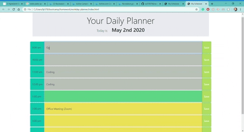

### Workday Planner

## Link to the Planner
https://lp5786766.github.io/workday-planner/

## Description

Daily planner for Office Hours (9:00 am - 5:00 pm).
The page displays:
1. Today's date.
2. 9 timeslots with time, task field, save button.

## Functionality

### Add Tasks
Simply click on the field where you would like to add the task, type the name of the task, and click "Save".
### Delete tasks
Click on the existing task and erase the text. Click "Save" to save changes.
All changes will persist after refreshing the page.
### Color-coding
For your convenience events are color-coded depending on the time of the workday:
- current - green
- future - yellow
- past - gray
## Credits:
-[Luba Pecheneva](https://github.com/lp5786766)
